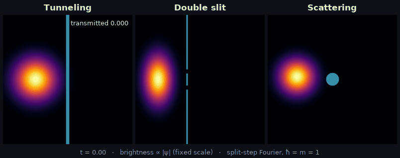
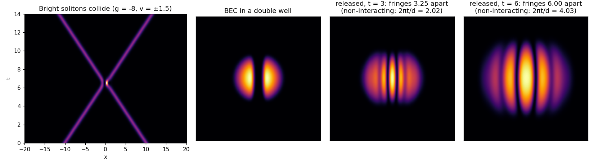

# Quantum Wave Lab


**[English](#english)** | **[日本語](#japanese)** · **[▶ Live demo / デモ](https://shianjeng.github.io/quantum-wave-lab/)**

<p align="center">
  
</p>

---

<a id="english"></a>
## English

An interactive simulator for the **time-dependent Schrödinger equation**, solved with the **split-step Fourier method (Strang splitting)**. The goal is a browser app where you draw potentials with the mouse and watch tunneling, double-slit interference and scattering in real time.

**Status:** the Python reference implementation (`qwave` 0.3.0), its validation and the reference data are complete, and a first browser version in plain JavaScript is live: **[try it](https://shianjeng.github.io/quantum-wave-lab/)**. Draw walls, launch packets, and measure the transmission live; it reproduces the Python reference data ([web/](web/README.md)). Next: C++ → WebAssembly for speed.

<sub>GIF: brightness ∝ |ψ| (fixed scale per panel). Δt = 0.005, Δx = 0.125. Relative density error vs. a 2× finer grid with Δt = 0.001: 1–5 %. Tunneling panel: V₀ = 10 > ⟨E⟩ ≈ 8; over-barrier (E > V₀) components contribute < 1 % of the transmitted probability.</sub>

### Features

- Split-step Fourier solver in 1D and 2D: unitary, O(Δt²) for smooth potentials, with an absorbing boundary
- Time-dependent potentials `V(t)`, and the Gross–Pitaevskii equation (`nonlinearity=g`) for solitons and Bose–Einstein condensates
- Stationary states and condensate ground states by imaginary-time propagation
- Live transmission from the probability current (`FluxDetector`), and step callbacks
- Single-precision mode that emulates the browser port, plus `diagnose()` for too-large Δt, under-resolved grids and misplaced packets
- 24 checks against analytic results ([validation](docs/validation.md)), and golden files for ports ([porting](docs/porting.md))
- A browser version ([web/](web/README.md)) that runs the same solver in single precision and passes those golden files: 10 scenes, drawing with undo, a momentum view, measurement, share links and video export



### Quick start

```bash
pip install -e ".[dev]"            # or: pip install -r requirements.txt
python -m pytest -q                # unit tests + reference data
python validate.py                 # analytic checks → figures/validation.png (--quick: checks only)
python demo_2d.py                  # double slit & 2D tunneling → figures/*.png, *.gif
python demo_gpe.py                 # soliton collision & BEC interference → figures/gpe.png
python make_gif.py                 # the GIF above → figures/hero.gif
python export_reference.py         # reference data for the port → reference/
cd web && node --test              # browser solver vs. reference data
```

```python
from qwave import FluxDetector, Grid, Solver, gaussian_packet
from qwave.potentials import double_slit

g = Grid((320, 320), (40, 40))                               # dx = 0.125
s = Solver(g, double_slit(g, height=50), dt=0.01, absorber=dict(gamma_max=10))
psi = gaussian_packet(g, center=(-10, 0), sigma=1.5, k0=(4, 0))
print(s.diagnose(psi))                                       # [] = no warnings
upper = FluxDetector(g, position=2.0, span=(0.0625, 19.9))   # behind the upper slit
upper.record(s.t, psi)
psi = s.step(psi, 500, callback=upper.record)
print(upper.transmitted)
```

### Documentation

- [Method](docs/method.md): time step, absorbing boundary, geometry on the grid, Gross–Pitaevskii stability, flux, `diagnose`
- [Validation](docs/validation.md): the checks, their errors and the figure
- [Porting](docs/porting.md): reference data and notes for the C++/WASM version
- [Browser version](web/README.md): files, tests and design choices of the web app
- [Changelog](CHANGELOG.md)

```
qwave/        solver, eigen (imaginary time), observables (flux), potentials, analytic references
tests/        unit tests and the reference-data check (CI)
docs/         method, validation, porting
reference/    golden files for ports (export_reference.py)
web/          the browser version (static site, published by GitHub Pages)
validate.py   analytic checks · demo_2d.py, demo_gpe.py, make_gif.py: figures
```

### Roadmap

- [x] Python reference implementation and numerical validation
- [x] Reference data that a port must reproduce (`reference/`)
- [x] Browser version in plain JS: draw potentials with the mouse, 10 scenes, live transmission, momentum view, measurement, share links; tested against `reference/`
- [x] Deploy on GitHub Pages
- [ ] Port to C++17 (FFT: pocketfft / KissFFT) with tests against `reference/`
- [ ] Compile to WebAssembly with Emscripten, render with WebGL2
- [ ] Benchmark: plain JS vs. WASM vs. WASM + SIMD

---

<a id="japanese"></a>
## 日本語

**時間依存シュレディンガー方程式**を**分割ステップ・フーリエ法（Strang 分解）**で解くシミュレータです。マウスでポテンシャルを描き、トンネル効果・二重スリット干渉・散乱をブラウザ上でリアルタイムに観察できる Web アプリを目指しています。

**現状:** Python によるリファレンス実装（`qwave` 0.3.0）、その数値検証、リファレンスデータが完成し、純粋な JavaScript による最初のブラウザ版を公開しました: **[試してみる](https://shianjeng.github.io/quantum-wave-lab/)**。壁を描き、波束を打ち出し、透過率をリアルタイムに計測でき、Python のリファレンスデータを再現します（[web/](web/README.md#japanese)）。次は高速化のための C++ → WebAssembly です。

<sub>GIF：明るさ ∝ |ψ|（各パネル固定スケール）。Δt = 0.005, Δx = 0.125。2 倍細かい格子・Δt = 0.001 の計算との密度の相対誤差は 1–5%。トンネル側は V₀ = 10 > ⟨E⟩ ≈ 8 で、透過確率のうち障壁より高いエネルギー成分の寄与は 1% 未満。</sub>

### 主な機能

- 1D・2D の分割ステップ・フーリエ法ソルバ。ユニタリで、滑らかなポテンシャルでは O(Δt²)。吸収境界つき
- 時間依存ポテンシャル `V(t)`。ソリトンやボース・アインシュタイン凝縮を扱えるグロス・ピタエフスキー方程式（`nonlinearity=g`）
- 虚時間発展による定常状態・凝縮体の基底状態
- 確率流によるリアルタイムの透過率計測（`FluxDetector`）とステップごとのコールバック
- ブラウザ版を再現する単精度モード。大きすぎる Δt、粗すぎる格子、置き方のおかしい波包を見つける `diagnose()`
- 解析解との 24 項目の比較（[数値検証](docs/validation.md#japanese)）と、移植用のリファレンスデータ（[移植](docs/porting.md#japanese)）
- 同じソルバを単精度で動かし、そのリファレンスデータに合格するブラウザ版（[web/](web/README.md#japanese)）。10 のシーン、元に戻せる描画、運動量表示、測定、共有リンク、動画の書き出し

### 使い方

```bash
pip install -e ".[dev]"            # または: pip install -r requirements.txt
python -m pytest -q                # ユニットテスト＋リファレンスデータの照合
python validate.py                 # 解析解との比較 → figures/validation.png（--quick: チェックのみ）
python demo_2d.py                  # 二重スリット・2D トンネル → figures/*.png, *.gif
python demo_gpe.py                 # ソリトンの衝突・BEC の干渉 → figures/gpe.png
python make_gif.py                 # 冒頭の GIF → figures/hero.gif
python export_reference.py         # 移植用のリファレンスデータ → reference/
cd web && node --test              # ブラウザ版ソルバとリファレンスデータの照合
```

コード例は英語版の Quick start を参照してください。

### ドキュメント

- [手法](docs/method.md#japanese): 時間発展、吸収境界、格子上の形状、GP 方程式の安定条件、確率流、`diagnose`
- [数値検証](docs/validation.md#japanese): チェック項目・誤差・図
- [移植](docs/porting.md#japanese): リファレンスデータと C++/WASM 版への注意点
- [ブラウザ版](web/README.md#japanese): Web アプリのファイル構成・テスト・設計上の選択
- [変更履歴](CHANGELOG.md)

### ロードマップ

- [x] Python リファレンス実装と数値検証
- [x] 移植版が再現すべきリファレンスデータ（`reference/`）
- [x] 純粋な JS によるブラウザ版: マウスでポテンシャルを描画、10 のシーン、透過率のリアルタイム計測、運動量表示、測定、共有リンク。`reference/` で検証済み
- [x] GitHub Pages で公開
- [ ] C++17 移植（FFT: pocketfft / KissFFT）、`reference/` との照合テスト
- [ ] Emscripten で WebAssembly 化、WebGL2 で描画
- [ ] 性能比較: 純 JS vs WASM vs WASM + SIMD

---

## License

MIT © 2026 Hank Zhu
