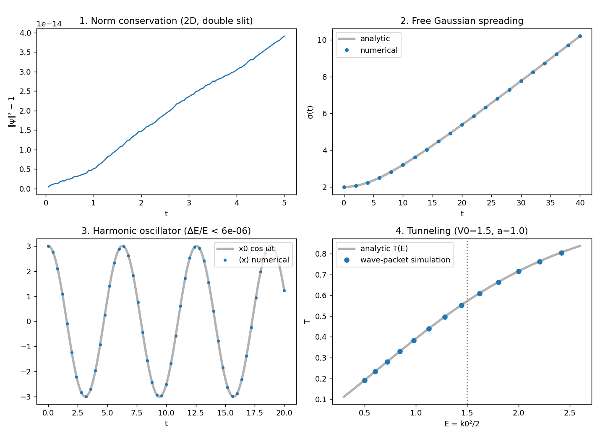

# Quantum Wave Lab — 量子波束シミュレータ


時間依存シュレディンガー方程式を **分割ステップ・フーリエ法（Strang 分解）** で解き、トンネル効果・二重スリット干渉・散乱をブラウザ上でリアルタイムに観察できるシミュレータを目指すプロジェクトです。
現在は Python による **リファレンス実装と数値検証** が完成した段階で、今後 C++ → WebAssembly + WebGL へ移植し、マウスでポテンシャルを描ける Web アプリにします。

*An interactive quantum wave-packet simulator. The Python reference solver here is validated against analytic results; it will be ported to C++/WebAssembly for real-time in-browser use.*

<p align="center">
  
</p>

<sub>明るさ ∝ |ψ|（各パネル固定スケール）。Δt = 0.005, Δx = 0.125。2 倍細かい格子・Δt = 0.001 の計算との密度の相対誤差は 1–5%。トンネル側は V₀ = 10 > ⟨E⟩ ≈ 8 で、透過確率のうち障壁より高いエネルギー成分の寄与は 1% 未満。</sub>

## 手法 / Method

単位系 ħ = m = 1。1 ステップは

```
ψ ← e^{-iV Δt/2} ψ  →  FFT  →  ψ ← e^{-ik² Δt/2} ψ  →  IFFT  →  ψ ← e^{-iV Δt/2} ψ
```

各演算子はユニタリなのでノルムは厳密に保存され、滑らかなポテンシャルでは時間誤差 O(Δt²)。境界での折り返しは吸収ポテンシャル e^{-γ(r)Δt} で抑制します（Δt に依存しない吸収率）。
ポテンシャルの幅・スリット幅は格子間隔 Δx の整数倍に取り、実効幅が公称値とずれないようにしています（`check_on_grid`）。

## 数値検証 / Validation

`python validate.py` で以下を解析解と比較します（CI で毎 push 実行）。

| テスト | 誤差 |
|---|---|
| 2D ノルム保存（二重スリット） | 4 × 10⁻¹⁴ |
| 自由粒子の波束の広がり σ(t) | 2 × 10⁻¹⁴ |
| 調和振動子コヒーレント状態 ⟨x⟩ = x₀cos ωt | 6 × 10⁻⁵ |
| 調和振動子のエネルギー保存（相対） | 6 × 10⁻⁶ |
| 矩形障壁の透過率 T(E)（運動量分布で平均した解析解と比較） | 9 × 10⁻⁴ |

2D デモ（`demo_2d.py`）では、x のみに依存する壁でのトンネル確率を
(a) 同じ Δx・Δt の 1D 計算（差 3 × 10⁻⁵：2D 実装の正しさ）と、
(b) 解析解（差 3.7%：リアルタイム用の粗い格子 Δx = 0.125 による離散化誤差）の両方と比較しています。
Web 版では、この「精度とリアルタイム性のトレードオフ」を格子サイズで調整します。



## 使い方 / Usage

```bash
pip install -r requirements.txt
python -m pytest -q      # 高速ユニットテスト
python validate.py       # 解析解との比較 → figures/validation.png
python demo_2d.py        # 二重スリット・2D トンネル → figures/*.png, *.gif
python make_gif.py       # README 冒頭の GIF → figures/hero.gif
```

## 構成 / Structure

```
qwave/solver.py      Grid, Solver, gaussian_packet, absorbing_mask
qwave/potentials.py  調和ポテンシャル, 矩形障壁, 二重スリット, ブラシ描画, 格子整合チェック
qwave/analytic.py    解析解（矩形障壁の透過率など）
validate.py          解析解との比較（図を出力）
demo_2d.py           2D デモ
make_gif.py          README 用 GIF の生成
tests/               CI 用ユニットテスト
```

## ロードマップ / Roadmap

- [x] Python リファレンス実装と数値検証
- [ ] C++17 移植（FFT: pocketfft / KissFFT）、Python と結果を突き合わせるテスト
- [ ] Emscripten で WebAssembly 化、WebGL2 で描画
- [ ] マウスでポテンシャルを描画、プリセット（トンネル・二重スリット・散乱）
- [ ] 性能比較: 純 JS vs WASM vs WASM+SIMD
- [ ] GitHub Pages で公開

## License

MIT
